# Collection Postman pour essais manuels :

*Remplacer le port et la version au besoin* 

## Health

```bash
GET http://localhost:3000/api/v1/health
```

---

## Locations

```bash
GET http://localhost:3000/api/v1/locations
```

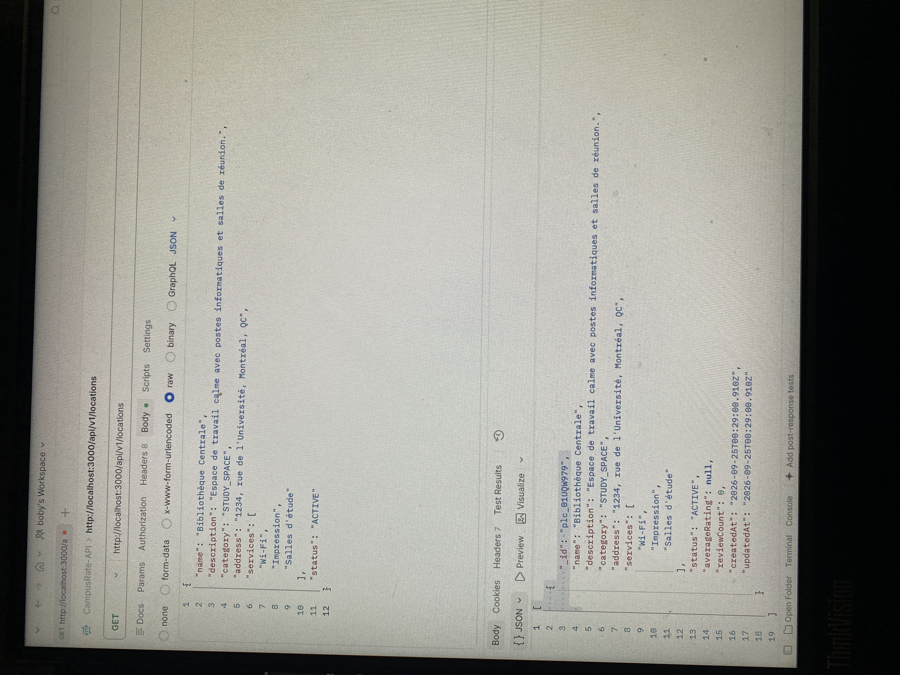
---

```bash
GET http://localhost:3000/api/v1/locations/{idLocation}
```

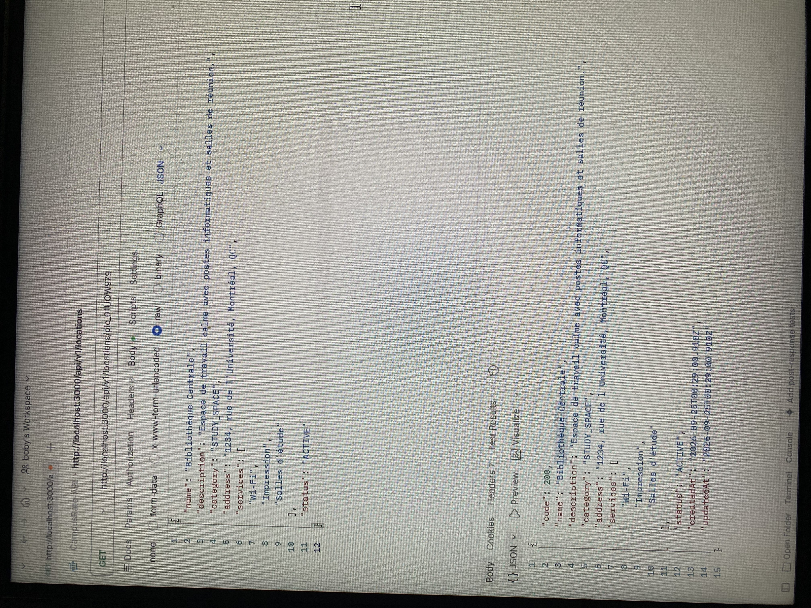
---

```bash
POST http://localhost:3000/api/v1/locations
Body :
{
  "name": "Bibliothèque Centrale",
  "description": "Espace de travail calme avec postes informatiques et salles de réunion.",
  "category": "STUDY_SPACE",
  "address": "1234, rue de l'Université, Montréal, QC",
  "services": [
    "Wi-Fi",
    "Impression",
    "Salles d'étude"
  ],
  "status": "ACTIVE"
}
```

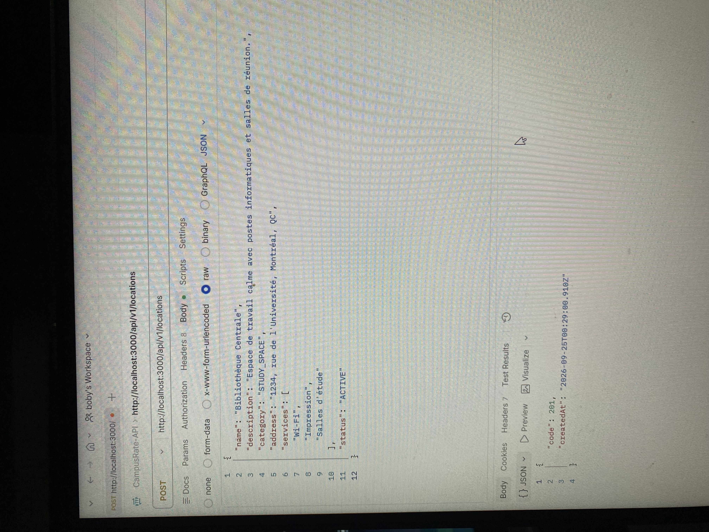
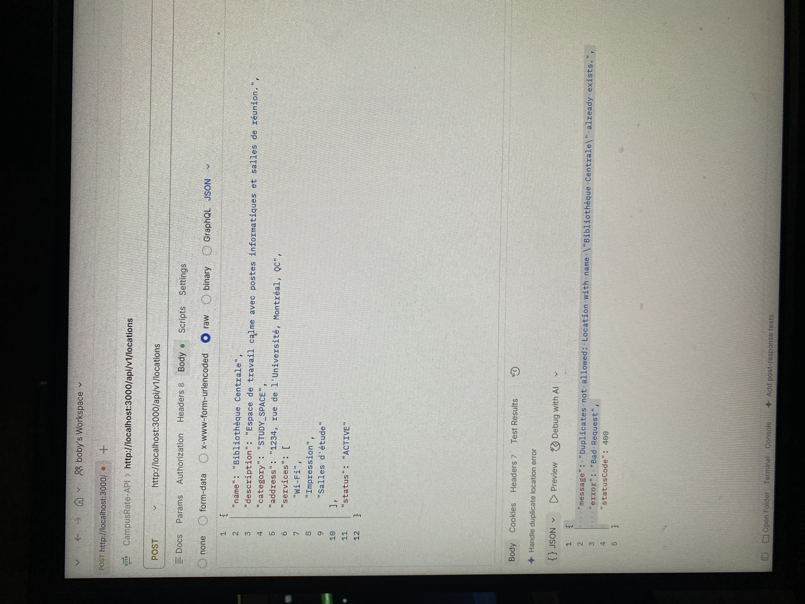
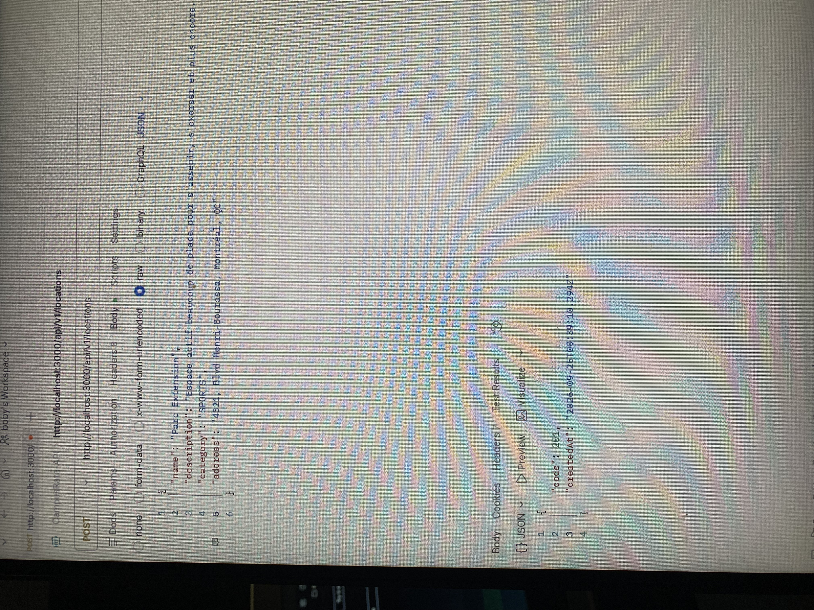
---

```bash
PATCH http://localhost:3000/api/v1/locations/{idLocation}
Body :
{
  "status": "CLOSED"
}
```

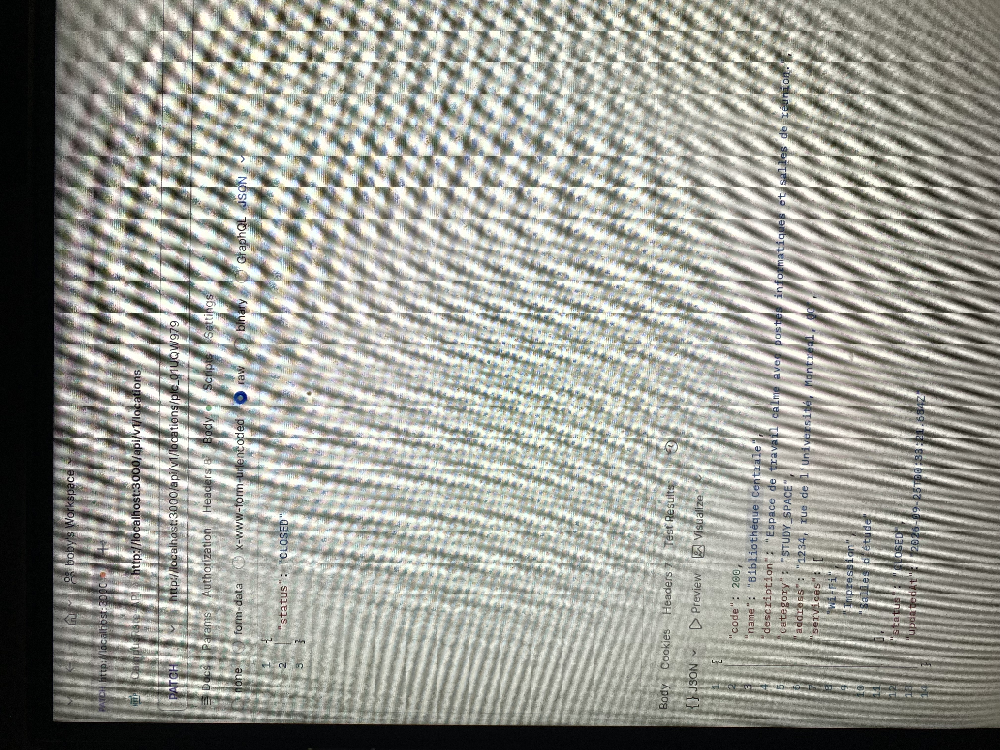
---

```bash
DELETE http://localhost:3000/api/v1/locations/{idLocation}
```

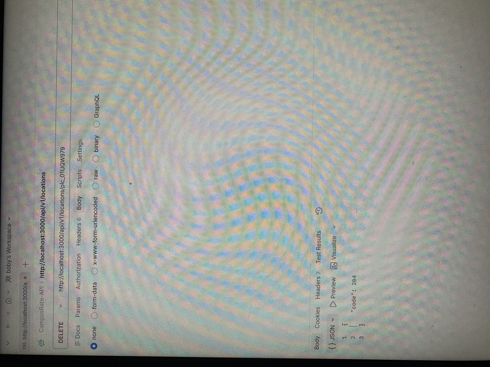
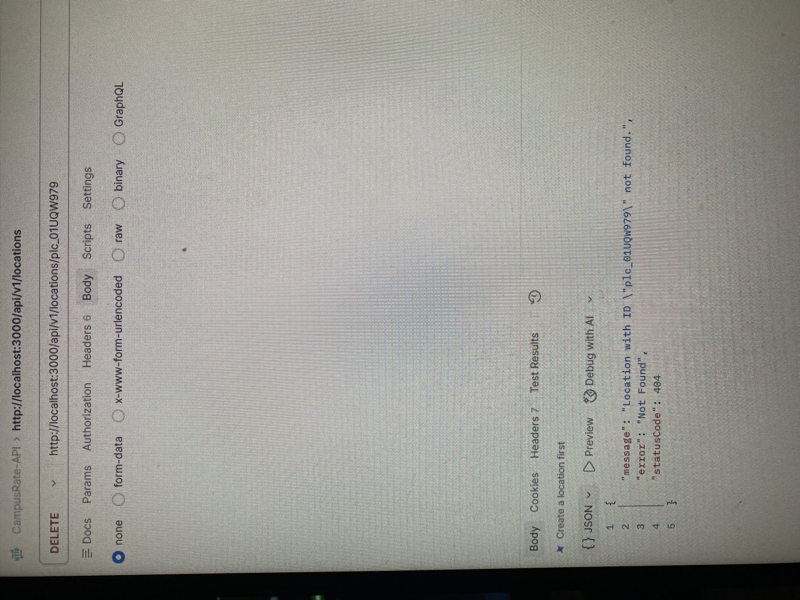
---

---

## Ratings

```bash
GET http://localhost:3000/api/v1/ratings
```

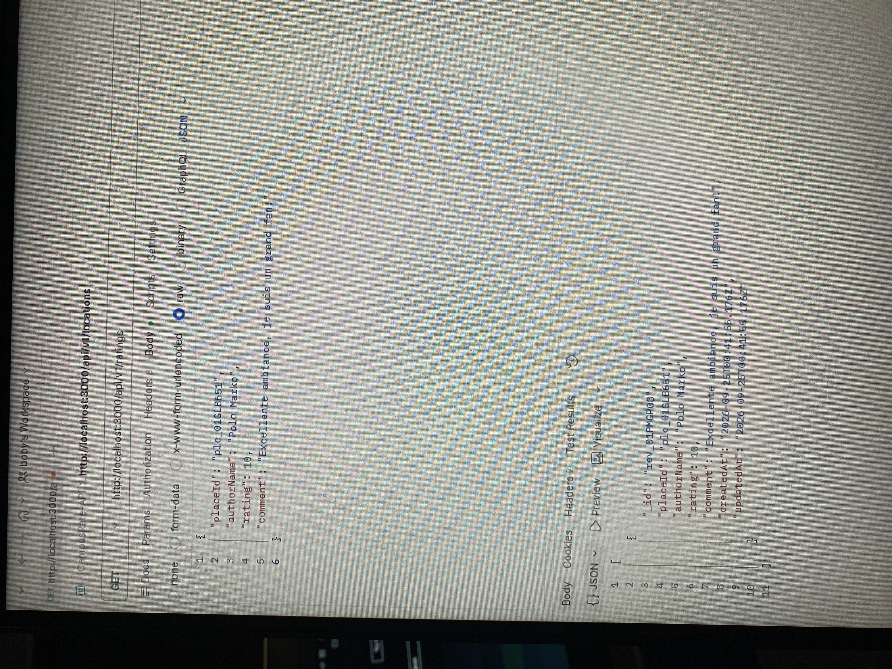
---

```bash
GET http://localhost:3000/api/v1/ratings/{idRating}
```

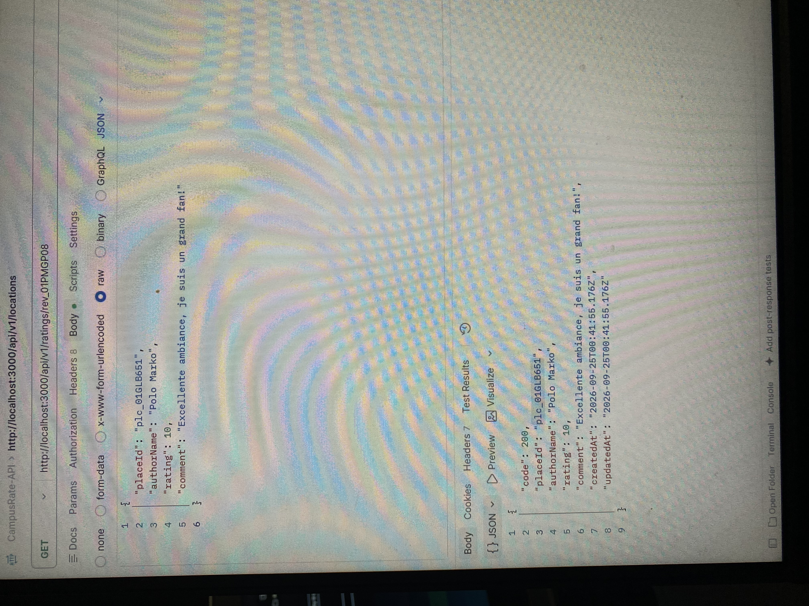
---

```bash
POST http://localhost:3000/api/v1/ratings
Body :
{
  "placeId": "{idLocation}",
  "authorName": "Polo Marko",
  "rating": 10,
  "comment": "Excellente ambiance, je suis un grand fan!"
}
```

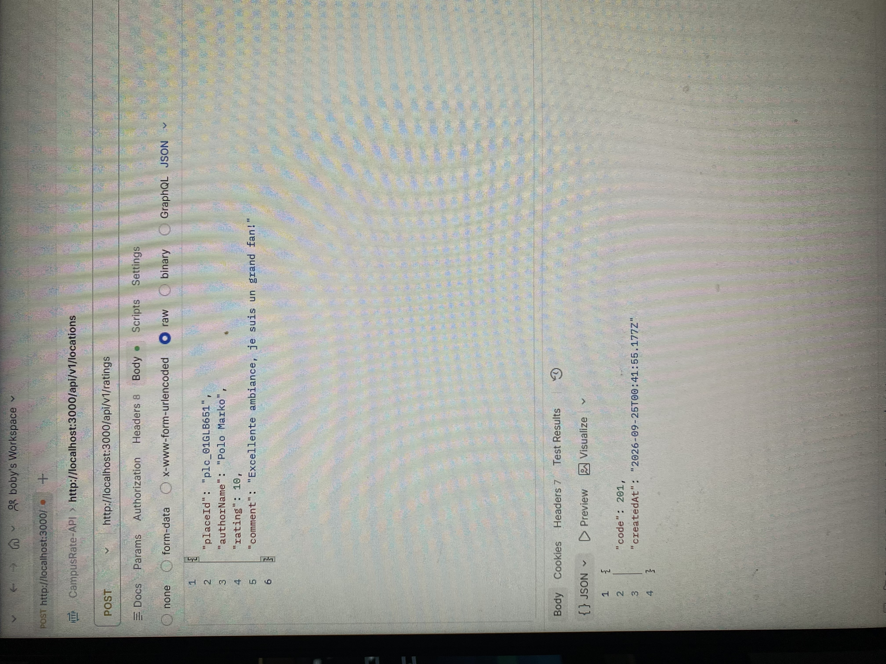

---

```bash
PATCH http://localhost:3000/api/v1/ratings/{idRating}
Body :
{
  "rating": 8
}
```

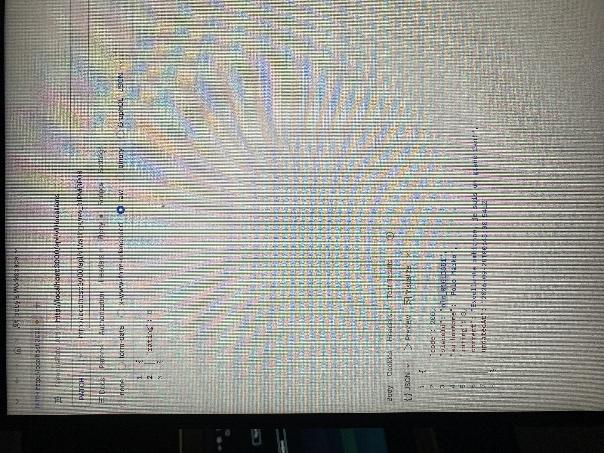

---

```bash
DELETE http://localhost:3000/api/v1/ratings/{idRating}
```
